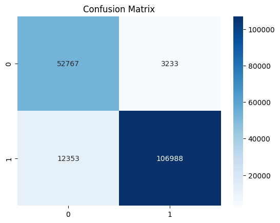
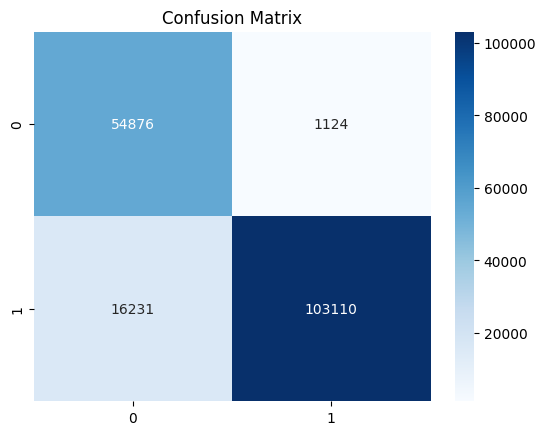

# ML-Based_NIDS_Classifier

## 📖 Overview
This repository hosts ML-Based_NIDS_Classifier, a machine-learning-powered Network Intrusion Detection System (NIDS) that classifies network flows from the UNSW-NB15 dataset into “malicious” or “benign.” It aims to provide researchers and practitioners with an easy-to-use, extensible framework for training, evaluating, and deploying anomaly-based intrusion detector

## 🔑Features

* Dataset Support: Built-in loaders for UNSW-NB15 training and testing sets

* Dataset Preparation: Preprocesses and normalizes data for model training

* Dataset Visualization: Visualizes data distributions and correlations

* Data Encoding: Converts categorical features into numerical representations

* Modular Architecture: SVM Classifier and XGBoost Classifier

* Evaluation Metrics: Generates confusion matrices, precision/recall reports

* Deployment Ready: Export models as serialized artifacts for integration into real-time NIDS

## 🗄 Dataset
UNSW-NB15: A labeled dataset of modern network traffic with 49 features and nine attack types, published by Moustafa & Slay (2015)

## ⚙ Model Training

* Training Pipeline: Trains SVM and XGBoost classifiers on UNSW-NB15 dataset

* Model Selection: Selects the best-performing model based on evaluation metrics

## 📊 Evaluation
### SVM
Confusion Matrix:

  
     
  <b>SVM Confusion Matrix</b>

Classification Report:
| Class         | Precision | Recall | F1-score | Support |
|---------------|-----------|--------|----------|---------|
| **0 (benign)**| 0.81      | 0.94   | 0.87     | 56,000  |
| **1 (malicious)** | 0.97  | 0.90   | 0.93     | 119,341 |
| **accuracy**  |           |        | **0.91** | 175,341 |
| **macro avg** | 0.89      | 0.92   | 0.90     | 175,341 |
| **weighted avg** | 0.92   | 0.91   | 0.91     | 175,341 |

### XGBoost
Confusion Matrix:

  
     
  <b>XGBoost Confusion Matrix</b>

Classifier Report:
| Class             | Precision | Recall | F1-score | Support  |
|-------------------|-----------|--------|----------|----------|
| **0 (benign)**    | 0.77      | 0.98   | 0.86     | 56,000   |
| **1 (malicious)** | 0.99      | 0.86   | 0.92     | 119,341  |
| **accuracy**      |           |        | **0.90** | 175,341  |
| **macro avg**     | 0.88      | 0.92   | 0.89     | 175,341  |
| **weighted avg**  | 0.92      | 0.90   | 0.90     | 175,341  |

## 🧑‍💻 License
This project is licensed under the MIT License – see the LICENSE file for details
